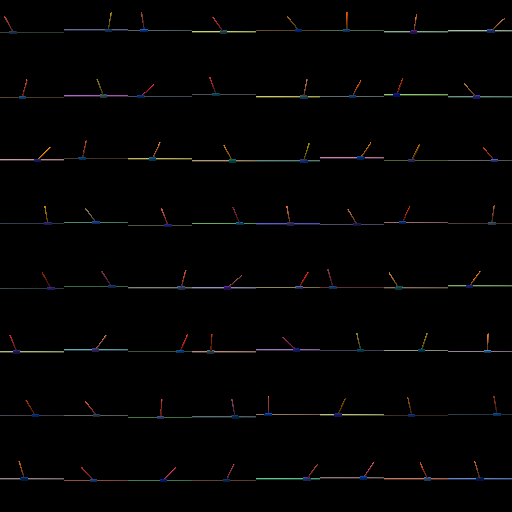
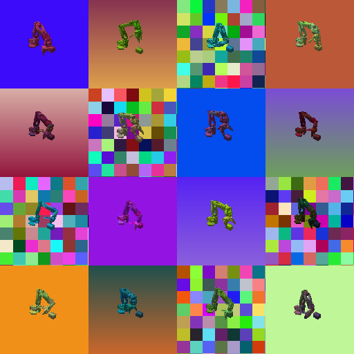
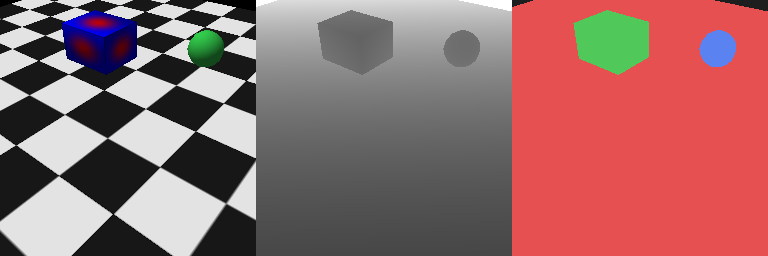
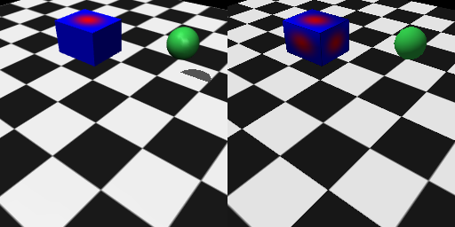

# mjbatch-metal

**Batched MuJoCo observation rendering, native on Apple Silicon.**

`mjbatch-metal` renders camera observations for many MuJoCo environments in a
single GPU submission — the tiled-batch architecture of
[Madrona](https://madrona-engine.github.io/) /
[madrona_mjx](https://github.com/shacklettbp/madrona_mjx) — implemented on
Metal (via [wgpu](https://github.com/pygfx/wgpu-py)), with no CUDA and no
translation layers. It exists to make **pixels-to-actions RL training
practical on a Mac**: on an M4 Max it renders ~19,000 composited 128×128
observations per second on a real robot scene (72,000+/s at 64×64 on simple
scenes), and runs full physics+rendering environment loops within ~2.2× of
MuJoCo Playground's published Franka-class figure — on a laptop, with no
CUDA. A 25M-step PPO-from-pixels run is a ~4-hour job.

## Why this exists

Batched rendering — drawing all N environments' camera views as tiles of one
frame in one submission, amortizing per-call overhead — is the established
architecture for high-throughput visual RL
([Madrona, SIGGRAPH Asia 2024](https://dl.acm.org/doi/10.1145/3680528.3687629);
[PyBatchRender, 2026](https://arxiv.org/html/2601.01288)). As of this
writing, no implementation runs natively on Apple GPUs:

- **madrona_mjx** (the MuJoCo batch renderer used by MuJoCo Playground)
  requires CUDA 12.x on Linux — NVIDIA only.
- **Madrona core** supports macOS/Apple Silicon for its *CPU simulation
  backend* only; its GPU backend is Linux-only and its Vulkan renderer has
  no supported or documented macOS path (MoltenVK translation is untested by
  the project).
- **PyBatchRender** (Panda3D/OpenGL) offers a portable CPU-copy path on
  Apple hardware, not a Metal-native renderer.

`mjbatch-metal` fills that gap with a small, auditable renderer written
directly against WebGPU/Metal.



*One frame, 64 environments: the tile atlas that a single `render()` call
produces (cartpole-class scene, per-env colors, poses, and camera jitter).*

## What it does

One `render()` call per simulation step, for all environments at once:

- **Tile atlas**: N environments → one texture, one render pass, one
  instanced draw (instance index = environment).
- **Per-environment everything**: camera pose, lighting direction, and
  per-geom RGBA colors are per-instance data — domain randomization costs
  nothing extra.
- **In-shader greenscreen compositing**: a background image per environment
  (a real photo of your deployment scene, or procedural noise) is drawn
  first; only robot/object pixels are drawn over it. The color attachment
  *is* the finished, composited observation — one readback per frame, and on
  Apple Silicon that readback lands in unified memory.
- **Geometry once, indexed, instanced per unique mesh**: each distinct mesh
  or primitive is stored once (smooth normals, UVs) and drawn with one
  instanced call covering every (env, geom) pair that uses it — the same
  structure Madrona/PyBatchRender use, which is what lets an undecimated
  348k-triangle scene render at 8.4K env-frames/s. Optional quadric
  decimation remains available.
- **Textures**: MuJoCo materials and textures (mesh UVs, planes, boxes) are
  atlas-packed and sampled in-shader; pattern parity vs `mujoco.Renderer`
  measured at 0.994 correlation. Per-env DR colors modulate textures.



*The intended observation style: a robot scene (SO-101, undecimated meshes)
with per-env link colors, camera jitter, and greenscreen-composited
backgrounds — solid, gradient, and noise here; photos of your real
deployment scene in practice.*



*One render, three outputs: textured RGB, metric depth, segmentation IDs.*



*Left: `mujoco.Renderer`. Right: mjbatch-metal. Texture pattern correlation
0.994; shading differs by design (see Validation).*

### What it deliberately does not do

Lambertian smooth shading with textures — but no shadows and no photorealism.
This is a renderer for **domain-randomized, background-composited RL
observations** — the observation style validated by sim-to-real work such as
[lerobot-sim2real](https://github.com/StoneT2000/lerobot-sim2real) (91.6%
real-world zero-shot on a low-cost arm with plain rasterized + composited
training images). If you need photorealism, use a real engine.

## Performance (measured)

Apple M4 Max (40-core GPU), 128×128 tiles, a 6-DoF arm scene with 20 visual
geoms, uncontended machine:

| configuration | throughput |
|---|---|
| `mujoco.Renderer`, one view per call (baseline) | ~71 fps/process |
| mjbatch-metal, single view | ~380 fps |
| mjbatch-metal, batched N=64, UNDECIMATED meshes (348k tris) | **~19,000 env-frames/s** (pipelined; 8.4k sync) |
| end-to-end PPO (SB3, MPS learner, threaded physics, N=64) | ~1,700 env-steps/s |

On the simpler primitives benchmark scene, throughput reaches **~72,700
env-frames/s at 64×64 with 1,024 environments** (pipelined readback) — see
[`benchmarks/results_m4max.md`](benchmarks/results_m4max.md) for the full
batch-size × resolution grid, the feature-coverage table versus madrona_mjx,
and notes on the oft-cited madrona_mjx throughput figures (they are
end-to-end physics-inclusive numbers on trivial scenes and datacenter
hardware, not renderer-only benchmarks — this project therefore publishes
methodology-matched end-to-end numbers and reproduce-it-yourself
instructions rather than a cross-platform perf/watt claim). Numbers are from one machine; treat them as
indicative. Rendering stops being the bottleneck at these rates — in the
end-to-end row the PPO update dominates.

**Depth observations** (`return_depth=True`, metric, parity-tested vs
`mujoco.Renderer`, median <1 cm), **segmentation-ID output**
(`return_seg=True`, per-geom IoU >0.85 vs the reference), **frustum
culling** (`cull=True`, output-identical), and **pipelined readback**
(`pipelined=True`, one-frame latency, +65-75% throughput via
unified-memory-mapped staging buffers) are all supported and tested.

## Validation

The test suite renders random states through both `mujoco.Renderer` and
`mjbatch-metal` and requires foreground-silhouette IoU > 0.90 (measured
0.96–0.98 on our scenes). Colors are *not* asserted equal: the shading
models differ by design, and the intended use randomizes colors and lighting
anyway. In a fixed-policy cross-evaluation on the development task this was
extracted from (a policy trained on an earlier iteration of this renderer,
evaluated on observations from the `mujoco.Renderer` pipeline), episode
returns were statistically indistinguishable (~1.2 SE at n=64 episodes per
side).

Battle-tested paths: mesh/box/plane/sphere/cylinder/capsule geometry (all
covered by the parity and stress tests), textures, one camera per env,
16–1,024 envs, 64–256 px tiles. Less exercised: non-square tiles, capsule
UVs.

## Quickstart

```python
import mujoco, numpy as np
from mjbatch import BatchRenderer

model = mujoco.MjModel.from_xml_path("scene.xml")
datas = [mujoco.MjData(model) for _ in range(64)]
for d in datas:
    mujoco.mj_forward(model, d)

r = BatchRenderer(model, 64, width=128, height=128, camera="my_cam")
cid = mujoco.mj_name2id(model, mujoco.mjtObj.mjOBJ_CAMERA, "my_cam")
r.set_backgrounds(range(64), [my_background_image] * 64)

tiles = r.render(
    datas,
    cam_pos=np.tile(model.cam_pos[cid], (64, 1)),   # per-env camera pose
    cam_quat=np.tile(model.cam_quat[cid], (64, 1)),
)  # -> (64, 128, 128, 3) uint8, already composited
```

`examples/` contains the full pipeline this was extracted from: a
Stable-Baselines3 `VecEnv` that fuses threaded MuJoCo physics with batched
rendering (`so101_lift_vecenv.py`) and a PPO-from-pixels training script
(`train_ppo_pixels.py`), targeting the SO-101 arm from
[mujoco_menagerie](https://github.com/google-deepmind/mujoco_menagerie).

## Install

```
pip install -e ".[decimate,test]"
pytest
```
(Verified in a clean venv: install + full test suite pass with dependencies
resolved from PyPI.)

Requires macOS on Apple Silicon (wgpu selects the Metal backend
automatically). The code is plain WebGPU and may work on other wgpu
backends (Vulkan/DX12); only Metal is tested.

## Status

Alpha, extracted from a working sim-to-real project (2026-08). The API is
small and may change. Issues and PRs welcome — especially parity reports
from scenes unlike ours.

## License

MIT.
